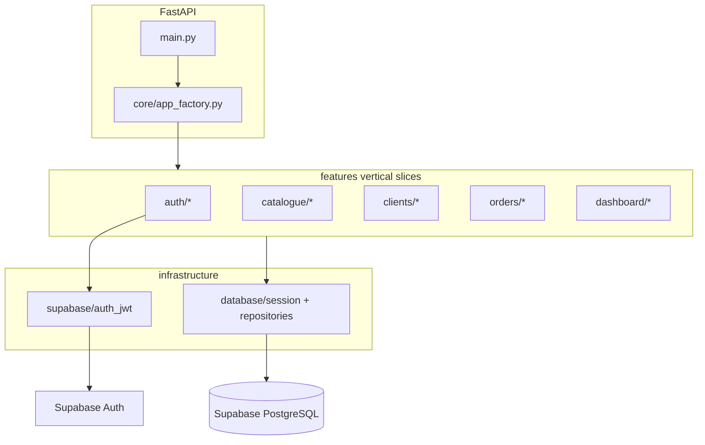

# Plan : Cocoyo API (VSA + Supabase + FastAPI)

## Périmètre

- **Ce dépôt** : API REST Python/FastAPI uniquement (le Next.js reste un autre projet, comme dans [docs/Projet 1.pdf](docs/Projet%201.pdf)).
- **Objectif de cette phase** : fichiers de base, structure VSA complète, schéma BDD + migrations Supabase, auth JWT, squelettes implémentables slice par slice (pas le frontend).
- **Documentation code** : **chaque fonction** du projet (et chaque module / classe Pydantic) porte une **docstring ultra détaillée**, normée et homogène (voir section dédiée ci-dessous).
- **Nettoyage** : supprimer l’ancienne arborescence incohérente (`features/authentification/catalogue/*`, fichiers vides [`main.py`](main.py), etc.) au profit de la structure ci-dessous.

## Cartographie cahier des charges → slices VSA

| Module PDF | Slices (`features/`) |
| ------------ | ---------------------- |
| A – Catalogue | `catalogue/create_product`, `list_products`, `update_product`, `deactivate_product` |
| B – Commandes | `clients/create_client`, `clients/list_clients`, `orders/create_order`, `orders/list_orders`, `orders/get_order` |
| C – Statuts | `orders/update_payment_status`, `orders/update_delivery_status` |
| D – Dashboard | `dashboard/get_overview`, `orders/search_orders` |
| Auth (choix validé) | `auth/register`, `auth/login`, `auth/me` |

Chaque slice contient **toujours** les mêmes fichiers (convention VSA du repo) :

- `router.py` - `APIRouter` + endpoint(s)
- `schemas.py` - modèles Pydantic entrée/sortie
- `handler.py` - logique du cas d’usage (pas de logique métier dans `router.py`)
- `__init__.py` - export du router (+ docstring de module décrivant le cas d’usage et le lien PDF)

## Convention docstrings (obligatoire sur tout le code Python)

Référence officielle du repo : [`docs/DOCSTRINGS.md`](docs/DOCSTRINGS.md) (à créer en première étape). Style **Google Python** étendu, en **français** (aligné avec l’équipe et le cahier des charges).

### Périmètre

| Élément | Docstring requise |
| -------- | ----------------- |
| Chaque fichier `.py` | Docstring **de module** en tête de fichier |
| `def` / `async def` (handlers, routers, core, infra, shared, tests helpers) | Docstring **complète** |
| Classes ORM SQLAlchemy | Docstring classe + courte doc sur colonnes non évidentes en commentaire ou dans la doc classe |
| Modèles Pydantic (`schemas.py`) | Docstring **classe** + `Field(..., description=...)` sur chaque champ exposé API |
| `APIRouter` / endpoints FastAPI | Docstring sur la fonction route (utilisée par OpenAPI) **en plus** de la doc du handler si la route délègue |

**Exceptions** : pas de docstring sur les `__init__.py` vides d’une ligne ; les migrations SQL utilisent des commentaires `--` en tête de fichier et par bloc (tables, RLS, enums).

### Structure minimale d’une docstring fonction (ultra détaillée)

Chaque fonction métier suit ce canevas (sections absentes si vraiment N/A, avec mention « N/A » explicite) :

1. **Résumé** - une phrase d’intention (quoi + pourquoi).
2. **Contexte** - module PDF (A/B/C/D), slice VSA, utilisateur cible (ex. opérateur back-office).
3. **Préconditions** - auth JWT requise ou non, entités qui doivent exister, statuts autorisés.
4. **Comportement détaillé** - étapes numérotées (lecture BDD, validations, calculs, effets de bord).
5. **Règles métier** - invariants (ex. produit `is_active`, snapshot `unit_price` sur lignes, enums paiement/livraison).
6. **Transactions** - si `commit`/`rollback`, isolation, ce qui est atomique.
7. **Args** - chaque paramètre (type, sémantique, contraintes de validation).
8. **Returns** - structure retournée, champs calculés, cas liste vide.
9. **Raises** - exceptions domaine (`core/exceptions`) et codes HTTP associés côté router.
10. **Effets de bord** - écritures tables, appels Supabase Auth, pas d’effet si lecture seule.
11. **Exemple** - bloc minimal d’appel ou payload JSON (pour handlers et routes).
12. **Voir aussi** - handler lié, slice adjacente, [`shared/order_totals.py`](shared/order_totals.py), etc.

### Exemple cible (handler - extrait)

```python
async def handle_create_order(session: AsyncSession, payload: CreateOrderRequest) -> OrderResponse:
    """Crée une commande multi-articles avec calcul du total et snapshot des prix.

    Contexte:
        Module PDF B (prise de commande). Slice ``features/orders/create_order``.

    Préconditions:
        - Appelant authentifié (JWT Supabase valide).
        - ``client_id`` existe.
        - Chaque ``product_id`` référence un produit ``is_active=True``.
        - Chaque ``size`` est dans ``product.sizes``.

    Comportement:
        1. Charge les produits demandés en une requête.
        2. Valide quantités (> 0) et cohérence tailles.
        3. Calcule ``total_amount`` via ``compute_order_total``.
        4. Insère ``orders`` puis ``order_lines`` (prix unitaire figé).
        5. Commit transaction unique.

    Args:
        session: Session SQLAlchemy async liée à la requête HTTP.
        payload: Corps validé Pydantic (client + lignes).

    Returns:
        OrderResponse: Commande persistée avec lignes et montant total.

    Raises:
        ProductNotFoundError: Produit absent ou inactif.
        InvalidOrderLineError: Taille ou quantité invalide.

    Exemple:
        >>> # payload JSON
        >>> {"client_id": "...", "lines": [{"product_id": "...", "size": "M", "quantity": 2}]}
    """
```

Les **routers** reprennent en plus : méthode HTTP, chemin, tags OpenAPI, statuts de réponse possibles (200/201/400/401/404/422).

### Modèles Pydantic

- Docstring de classe : rôle du DTO, slice, endpoint(s) qui l’utilisent.
- Chaque champ : `description` FR incluant format, optionnel/obligatoire, exemple.

### Qualité et maintenance

- Lors de l’implémentation, **aucune fonction livrée sans docstring** conforme au canevas.
- [`pyproject.toml`](pyproject.toml) : configurer **Ruff** `pydocstyle` (règles Google sélectionnées, ex. `D100` module, `D101` classe publique, `D103` fonction publique) en **warning** en phase 1 (pas bloquant CI si trop strict sur tests).
- Test léger [`tests/test_docstrings.py`](tests/test_docstrings.py) : pour chaque `handler.py` sous `features/`, vérifier que les fonctions `handle_*` contiennent les sections ``Args:`` et ``Raises:`` (ou ``Returns:`` pour lectures).

### Ordre dans le plan d’implémentation

Créer [`docs/DOCSTRINGS.md`](docs/DOCSTRINGS.md) **avant** le bootstrap code, puis appliquer la convention dès le premier fichier Python (`core/config.py`).

## Architecture cible



### Dossiers transverses

| Dossier | Rôle |
| --------- | ------ |
| [`core/`](core/) | `config.py` (Pydantic Settings), `app_factory.py`, `dependencies.py` (`get_db`, `get_current_user`), `exceptions.py`, handlers HTTP globaux |
| [`infrastructure/database/`](infrastructure/database/) | Engine SQLAlchemy 2 **async** (`asyncpg`), `session.py`, modèles ORM centralisés (une table = un fichier), `base.py` |
| [`infrastructure/supabase/`](infrastructure/supabase/) | Client `supabase-py` (Auth sign-up/sign-in), vérification JWT (`get_user` / clé JWT) - **jamais** la `service_role` côté routes publiques |
| [`shared/`](shared/) | Enums métier (`PaymentStatus`, `DeliveryStatus`), constantes, helpers (ex. calcul total commande) |
| [`supabase/migrations/`](supabase/migrations/) | SQL versionné pour le projet Supabase |

**Choix d’accès données** : le PDF cite SQLAlchemy ; on utilise **SQLAlchemy async + URL Postgres Supabase** (pooler, port 6543) pour les slices métier, et **supabase-py** uniquement pour l’Auth. Cela évite de dupliquer la logique d’agrégation dashboard dans PostgREST.

## Schéma PostgreSQL (Supabase)

Migration initiale `supabase/migrations/00001_initial_schema.sql` :

- **`clients`** : `id` (uuid), `name`, `contact`, `created_at`, `updated_at`, index sur `name`
- **`products`** : `id`, `name`, `category`, `sizes` (jsonb ou text[]), `unit_price` (numeric), `is_active` (bool, défaut true), timestamps
- **`orders`** : `id`, `client_id` (FK), `ordered_at`, `payment_status` (enum), `delivery_status` (enum), `total_amount` (numeric, persisté après calcul), timestamps
- **`order_lines`** : `id`, `order_id` (FK), `product_id` (FK), `size`, `quantity`, `unit_price` (snapshot au moment de la commande), contrainte unique `(order_id, product_id, size)` si pertinent

Enums (noms techniques EN, libellés FR dans l’API) :

- Paiement : `unpaid` | `deposit` | `paid` (PDF : Non payé, Acompte, Payé)
- Livraison : `not_delivered` | `shipping` | `delivered`

**RLS** (back-office mono-marque, tous les utilisateurs authentifiés partagent les données) :

- `ALTER TABLE ... ENABLE ROW LEVEL SECURITY`
- Politiques `FOR ALL TO authenticated USING (true) WITH CHECK (true)` sur les 4 tables - suffisant pour un petit back-office ; à durcir plus tard si multi-tenant.

Le backend se connectera avec l’utilisateur DB **via pooler** ; en dev, documenter dans [`.env.example`](.env.example) : `SUPABASE_URL`, `SUPABASE_ANON_KEY`, `SUPABASE_SERVICE_ROLE_KEY` (serveur uniquement), `DATABASE_URL` (async).

## Bootstrap applicatif

Fichiers racine à créer :

- [`pyproject.toml`](pyproject.toml) ou [`requirements.txt`](requirements.txt) : `fastapi`, `uvicorn[standard]`, `pydantic-settings`, `sqlalchemy[asyncio]`, `asyncpg`, `supabase`, `python-jose` ou validation via SDK, `httpx`
- [`.env.example`](.env.example) - variables sans secrets réels
- [`.gitignore`](.gitignore) - `.env`, `__pycache__`, `.venv`
- [`main.py`](main.py) - `uvicorn` entry : `from core.app_factory import create_app`

[`core/app_factory.py`](core/app_factory.py) :

- `create_app()` : CORS (origine Next.js configurable), inclusion de **tous** les routers des slices, route `GET /health`
- Dependency globale optionnelle : routes métier protégées par `Depends(get_current_user)` ; `register`/`login` publics

## Détail des slices (comportement minimal attendu)

### Auth

- **`register`** : `POST /auth/register` → `supabase.auth.sign_up` (email/password)
- **`login`** : `POST /auth/login` → `sign_in_with_password`, retour `access_token` + `refresh_token`
- **`me`** : `GET /auth/me` → profil depuis JWT

### Catalogue (Module A)

- **create** : `POST /catalogue/products` - validation tailles/prix
- **list** : `GET /catalogue/products` - filtre `?active_only=true`
- **update** : `PATCH /catalogue/products/{id}`
- **deactivate** : `POST /catalogue/products/{id}/deactivate` (soft delete)

### Clients (prérequis Module B)

- **create** : `POST /clients`
- **list** : `GET /clients`

### Orders (Modules B + C)

- **create_order** : `POST /orders` - body : `client_id` + lignes `{product_id, size, quantity}` ; handler charge les prix produits actifs, calcule `total_amount`, crée commande + lignes en transaction
- **list_orders** : `GET /orders` - pagination simple
- **get_order** : `GET /orders/{id}` - client + lignes
- **update_payment_status** : `PATCH /orders/{id}/payment-status`
- **update_delivery_status** : `PATCH /orders/{id}/delivery-status`
- **search_orders** : `GET /orders/search?q=&payment_status=&delivery_status=` (Module D)

### Dashboard (Module D)

- **get_overview** : `GET /dashboard/overview` - agrégats SQL :
  - CA encaissé (somme `total_amount` où `payment_status = paid` + partiellement `deposit` si règle métier définie dans handler)
  - montant impayés (`unpaid` + reliquat `deposit` - documenter la règle dans `handler.py`)
  - nombre commandes `delivery_status IN (not_delivered, shipping)`

Logique de calcul partagée : [`shared/order_totals.py`](shared/order_totals.py) pour éviter duplication entre `create_order` et futurs tests.

## Enregistrement des routes

Fichier [`features/router_registry.py`](features/router_registry.py) qui importe et retourne la liste des routers - `app_factory` n’importe qu’un seul module pour garder `main.py` minimal.

## Tests et qualité (fichiers de base)

- [`tests/conftest.py`](tests/conftest.py) - client TestClient + overrides DB (optionnel phase 1)
- Un test smoke : `GET /health` → 200

## Ordre d’implémentation recommandé

0. Norme docstrings (`docs/DOCSTRINGS.md` + exemple de référence)
1. Bootstrap (`pyproject`, `core`, `main`, `.env.example`)
2. Migration Supabase + modèles SQLAlchemy alignés
3. `infrastructure` (session, supabase auth)
4. Slices `auth` puis `clients` / `catalogue` (données de référence)
5. `orders/create_order` + statuts + recherche
6. `dashboard/get_overview`
7. Suppression anciens chemins `features/authentification/**` et `features/commandes/**`

## Vérification après mise en place

- `uvicorn main:app --reload` - `/health` OK
- Appliquer migration sur le projet Supabase (`supabase db push` ou SQL Editor)
- `register` → `login` → appel `GET /dashboard/overview` avec `Authorization: Bearer <token>`

## Hors périmètre (explicitement)

- Frontend Next.js
- Stock physique / inventaire par taille (le PDF parle de tailles sur le produit, pas de décrément stock)
- Déploiement Render (possible plus tard ; rappel : bind `0.0.0.0:$PORT` si web service)
